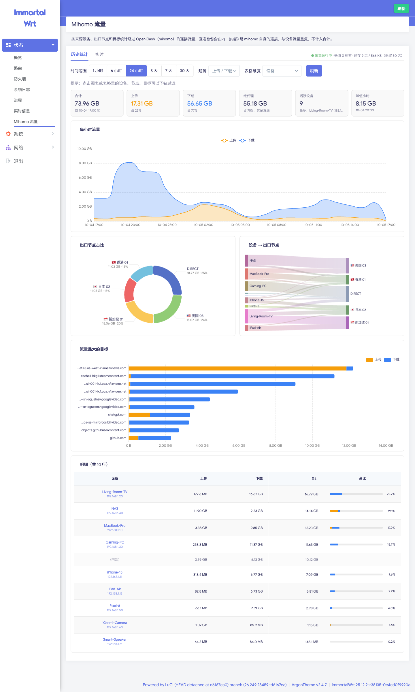
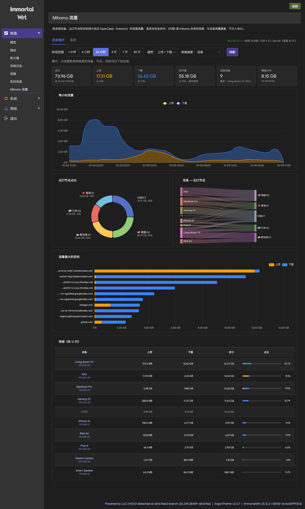
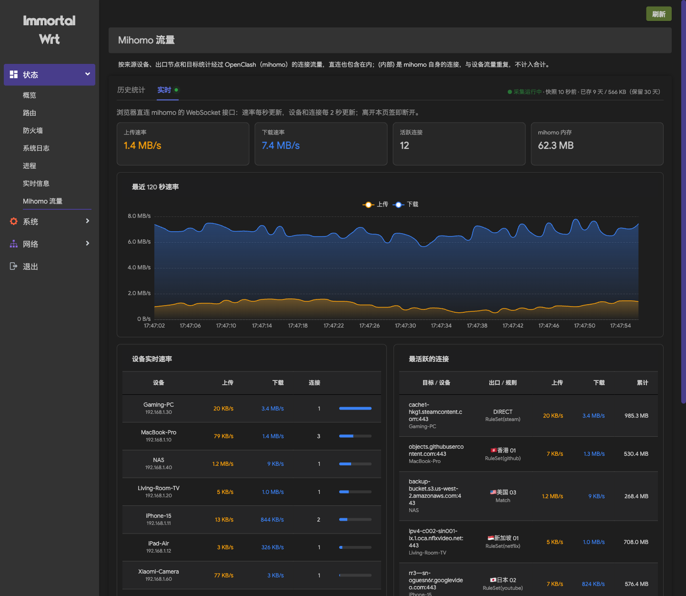
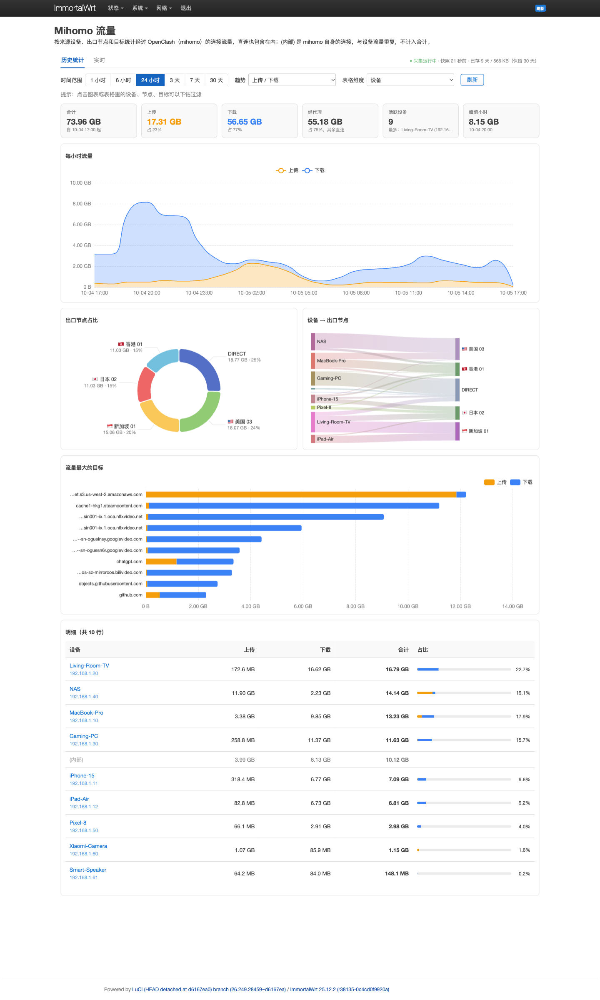

# luci-app-mihomo-traffic：OpenClash 流量统计插件

[](https://github.com/hoobnn/luci-app-mihomo-traffic/releases/latest)
[](https://github.com/hoobnn/luci-app-mihomo-traffic/actions/workflows/build.yml)
[](https://openwrt.org/)
[](LICENSE)

**简体中文** · [English](README.en.md)

OpenWrt / ImmortalWrt 的 LuCI 插件：基于 mihomo（Clash Meta，OpenClash 内核）的连接数据，按设备、出口节点、目标域名统计流量，带历史趋势和实时速率面板。

开启了全锥形 NAT（`kmod-nft-fullcone`）的路由器上，nlbwmon 收不到 conntrack 事件、统计一直为空；本插件不依赖 conntrack，直接读 mihomo 的连接表，可以替代 nlbwmon 做「哪台设备用了多少流量、走了哪个节点、访问了哪些网站」的统计。



<details>
<summary>更多截图：深色模式、实时面板、Bootstrap 主题</summary>

| 历史统计（Argon 深色） | 实时面板（Argon 深色） |
|---|---|
|  |  |



</details>

<sub>截图中的设备、节点和流量均为演示数据，由 `tests/demo-data.uc` 生成。</sub>

## 功能

- 按设备 / 出口节点 / 目标统计：每台设备的上传下载、每个代理节点（含 DIRECT）承担了多少流量、流量最大的域名，可任意组合维度，点击即可下钻过滤。
- 历史趋势：按小时（72 小时内）或按天（最长 30 天）查看，可按上传下载、设备或出口节点分组。
- 可视化：出口节点占比、设备 → 出口节点流向（桑基图）、目标排行，基于本地打包的 Apache ECharts，不依赖外网 CDN。
- 实时面板：浏览器直连 mihomo WebSocket，每秒刷新总速率曲线，以及各设备实时速率和最活跃的连接。
- 适配主题：Argon、Bootstrap 等主题的浅色和深色模式自动适配，强调色跟随主题。
- 轻量：采集进程用 ucode 编写，不装 Python、Node 或数据库；实测占单核约 1.3%，常驻内存约 3 MB。
- 命令行：`mihomo-traffic stats` 在 SSH 里直接出报表。

## 与其他方案的区别

| | 本插件 | nlbwmon | 外部面板（如 neko-master、clash-traffic-monitor） |
|---|---|---|---|
| 全锥形 NAT 下可用 | ✅ | ❌ 收不到 conntrack 事件 | ✅ |
| 按出口节点、域名统计 | ✅ | ❌ 只有 IP 和协议 | ✅ |
| 运行位置 | 路由器本机，集成在 LuCI | 路由器本机 | 需要另一台机器或 Docker / Node 环境 |
| 额外依赖 | 无（ucode、curl 均为系统自带） | 无 | Node.js / Docker / 数据库 |

## 安装

要求：OpenWrt 或 ImmortalWrt 24.10 及以上，已安装并运行 OpenClash（插件从 OpenClash 的配置读取 mihomo 控制端口和密钥）。

从 [Releases](https://github.com/hoobnn/luci-app-mihomo-traffic/releases/latest) 下载对应格式的安装包，传到路由器的 `/tmp`（如 `scp -O luci-app-mihomo-traffic*.apk root@192.168.1.1:/tmp/`）。插件与 CPU 架构无关，x86_64、aarch64、mips 等通用。

### 25.12 及以后（apk）

```sh
apk add --allow-untrusted /tmp/luci-app-mihomo-traffic-*.apk
```

### 24.10（opkg）

```sh
opkg install /tmp/luci-app-mihomo-traffic_*.ipk
```

安装后采集服务自动启动，刷新 LuCI 即可在「状态 › Mihomo 流量」看到页面。数据从安装时开始累计。

### 更新

下载新版本安装包，用同样的命令安装即可覆盖升级。安装后采集进程会自动重启，历史数据保留。

### 卸载

`apk del luci-app-mihomo-traffic` 或 `opkg remove luci-app-mihomo-traffic`。历史数据保留在 `/etc/mihomo-traffic/`，不需要可手动删除。

## 使用

### 网页

- 历史统计：选择时间范围、趋势分组和表格维度；点击图表或表格里的设备、节点、目标会加上过滤条件，点击过滤标签可以移除。
- 实时：切到这个页签时才连接 mihomo WebSocket，离开即断开。需要浏览器能直接访问路由器的 mihomo 控制端口（OpenClash 默认 9090）；通过 HTTPS 访问 LuCI 时浏览器不允许连接 `ws://`，实时面板不可用。

### 命令行

```sh
mihomo-traffic stats                 # 最近 24 小时，按设备
mihomo-traffic stats 2 src,host      # 最近 2 小时，按设备和目标
mihomo-traffic stats 168 node        # 最近 7 天，按出口节点
```

维度可选 `src`、`node`、`host` 及其组合。`(内部)` 行是 mihomo 自身发起的连接（链式代理的承载连接、DoH 等），与设备流量重复，不计入合计。

## 工作原理

```text
mihomo /connections ──每秒轮询──▶ mihomo-traffic（procd 托管的 ucode 进程）
                                   │ 按「设备 / 出口节点 / 目标」累计字节增量
                                   ├─ 每分钟快照 ─▶ /tmp/mihomo-traffic.cur
                                   └─ 每小时归档 ─▶ /etc/mihomo-traffic/YYYY-MM-DD.tsv
                                                     │
LuCI 页面 ◀── rpcd（ucode 插件 luci.mihomo-traffic）──┘  查询、缓存、生成日汇总
     └──── 实时面板直连 mihomo WebSocket（/traffic、/connections、/memory）
```

- 存储：每小时一行一个「设备 + 节点 + 目标」组合，一小时内不足 16 KB 的目标合并为 `(小流量)`；保留 30 天，系统升级（sysupgrade）时自动保留。
- 查询：72 小时内按小时读原始数据；更长范围按天读日汇总（单日不足 1 MB 的目标合并为 `(小流量)`），30 天查询约 0.5 秒；数据不变时直接返回缓存。
- 精度：mihomo 接口提供的是连接快照而不是事件，存活不足 1 秒的连接、以及连接关闭前最后不到 1 秒的流量会漏计；直连（DIRECT）流量只有经过 mihomo 时才会被统计（如 TUN / 透明代理模式）。

## 常见问题

**nlbwmon 在全锥形 NAT 下为什么不工作？**
`kmod-nft-fullcone` 会占用 conntrack 事件通知，nlbwmon 收不到连接事件，统计一直为空。本插件读取 mihomo 的连接表，不受影响。

**统计和运营商、VPS 面板的流量对不上？**
本插件统计的是经过 mihomo 的连接字节数，不含协议开销、重传以及不经过 mihomo 的流量；链式代理的承载连接单独显示为 `(内部)`。

**会影响网速吗？**
不会。采集进程只读取 mihomo 的 API，不在转发路径上，以最低优先级（nice 19）运行。

## 从源码构建

插件按 OpenWrt 标准 LuCI 包组织，可以放进任意 OpenWrt SDK 的 feed 编译：

```sh
# 在 OpenWrt SDK 目录
echo "src-link mihomo /path/to/feed" >> feeds.conf.default   # feed 目录下放本仓库，目录名 luci-app-mihomo-traffic
./scripts/feeds update -a && ./scripts/feeds install luci-app-mihomo-traffic
make package/luci-app-mihomo-traffic/compile
```

CI 使用 [openwrt/gh-action-sdk](https://github.com/openwrt/gh-action-sdk) 分别以 25.12（apk）和 24.10（ipk）SDK 构建，推送 `v*` 标签时自动发布 Release。

### 开发

```sh
scripts/deploy.sh root@192.168.1.1   # 把文件直接拷到路由器，重载 rpcd；采集逻辑有变化时才重启采集进程
sh tests/smoke.sh                    # 在路由器或 OpenWrt rootfs 容器里跑冒烟测试
scripts/build-echarts.sh             # 重新按需打包 ECharts（需要 Node.js）
```

演示环境（截图用，不要在真实路由器上跑，会覆盖已有数据）：

```sh
ucode -L /usr/share/ucode tests/demo-data.uc               # 在测试路由器或容器里生成 8 天的虚构数据
uv run --with websockets tests/fake-mihomo.py 19090       # 假的 mihomo WebSocket，给实时面板喂数据
```

## 许可证

[Apache-2.0](LICENSE) © 2026 hoobnn。可自由使用、修改和分发，需保留版权声明。内置的 [Apache ECharts](https://echarts.apache.org/) 同为 Apache-2.0，许可证见 [`ECHARTS-LICENSE`](htdocs/luci-static/resources/mihomo-traffic/ECHARTS-LICENSE)。

